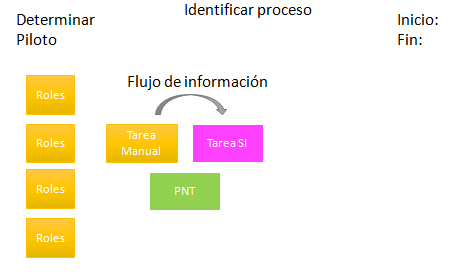
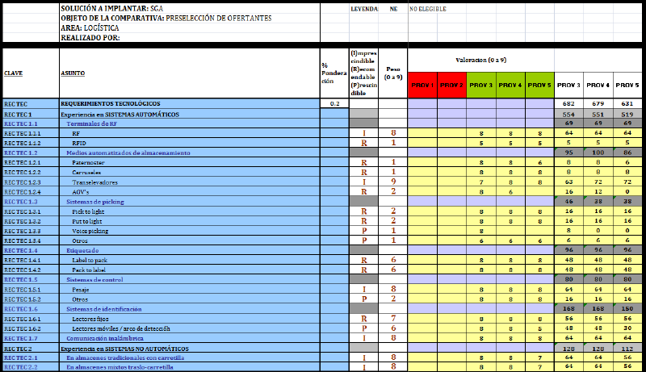
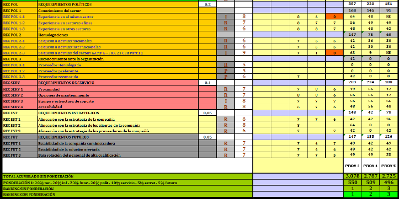

# Análise de requirimentos do usuario

A creación e análise dos **requisitos dos usuarios** permite concretar o alcance actual e futuro do sistema informatizado a nivel **operativo** (para os usuarios finais que o utilizan), **funcional** (rexistros xerados, controis en proceso, resultados obtidos e valores) e finalmente o **regulamentario** (segundo as normas correctas de fabricación e implantación).

A definición dos requisitos do usuario, por exemplo para unha empresa de fabricación, divídese nos seguintes procesos:

- Compras e devolucións a provedores.
- Loxística.
- QA.
- Garantía de calidade.
- Dirección técnica.
- Produción.
- Mantemento.
- Expedición do produto acabado e devolucións do cliente.

## Requisitos do usuario

Hai moitos **tipos de requisitos do usuario** a considerar:

- **Tecnolóxico** : especificando a tecnoloxía de desenvolvemento, a forma de comunicación con outros equipos, etc.
- **Ordenador** : detalle a plataforma de software (sistemas operativos e bases de  datos), características do servidor, virtualización e tamén interfaces  con outros sistemas informáticos.
- **Funcional** : determina as áreas de actuación do sistema, [os procesos a informatizar](https://www.oqotech.com/servicios/automatizacion-de-procesos/) e as principais funcionalidades. Especificando o seu grao de automatización, controis e verificacións no proceso a  realizar, procesos que se poidan desencadear como alertas, impresión de  informes ou etiquetas, comunicación con outros sistemas, etc.
- **Normativa** : ao longo do ciclo de vida dos datos, para garantir a trazabilidade, a seguridade e os procesos informatizados segundo a normativa aplicable.
- **Integridade dos datos** : centrada en todo o ciclo de vida dos datos, garantindo que sexan atribuíbles, lexibles, simultáneos, orixinais, exactos, consistentes, completos, duradeiros e tamén dispoñibles.

Unha vez realizada a definición de necesidades, cómpre **ponderar a importancia dos distintos tipos de requisitos.** No seguinte exemplo, vemos como aplicar os criterios de ponderación:

| **Tipo de requisito** | **% de ponderación** |
| --------------------- | -------------------- |
| Tecnolóxico           | 10                   |
| Informáticos          | 15                   |
| Funcional             | 25                   |
| Regulador             | 25                   |
| Integridade dos datos | 25                   |

## Análise dos requisitos dos usuarios

Coa participación dun equipo multidisciplinar se organiza o obradoiro de ideas para realizar a análise dos requisitos dos  usuarios e extraer toda a información da empresa. . Este obradoiro consiste en especificar de **forma gráfica**  **e detallada por escrito** por ámbitos do proceso analizado: os perfís do posto de traballo  implicado, o funcionamento actual, a utilización do sistema  informatizado no proceso e a funcionalidade esperada polo ERP (controis  en proceso). , resultados e valores). Así como identificar as funcionalidades do sistema informático estándar e as desenvolvidas a medida (se é o caso).

As conclusións se presentarán nun informe de requisitos dos usuarios.

O obradoiro precisa poucas ferramentas, será de predominancia visual. Tamén se precisa: un taboleiro de papel, post-it de diferentes cores e rotuladores.

## Pasos do taller

1. Coa presenza do equipo multidisciplinar, xérase unha relación de procesos que tamén debemos coñecer. Xérase un panel para cada un. O panel identifica o proceso, determina o piloto (persoa con máis xestión do proceso) e finalmente establécense límites:

1. A continuación, identifícanse os roles implicados no proceso, que o equipo identifica ao comezo. Despois pintase o proceso, diferenciando tarefas manuais (post-it en amarelo) e informáticas (post-it en rosa), os fluxos de información e os SOPs que  detallan o proceso (post-it en verde).

Por iso, este obradoiro **fomenta o coñecemento entre departamentos, a análise colectiva de procesos e é  posible detectar desviacións, reprocesamentos e falta de documentación.**

A partir dos obradoiros realizados para os procesos analizados, pódese emitir unha relación de necesidades:

- Procesos para informatizar.
- Controis a implementar.
- Procesos xa informatizados, a mellorar.
- Rexistros para xerar.
- Procesos que precisan modificar o funcionamento.
- Avisos e informes necesarios para xerar.
- En primeiro lugar, hai que recoller todos os requisitos, desde todos os puntos de vista do equipo de validación. Posteriormente, deberán **clasificarse segundo a súa criticidade** en imprescindibles, recomendables e prescindibles. Así como establecer o peso de prioridade dentro do mesmo nivel de  clasificación, utilizando unha escala numérica do 1 ao 9, sendo o 9 a  máxima prioridade:

O resultado da aplicación dos pasos anteriores é **unha lista de requisitos cuantificables** , priorizados por consenso, aprobados e valorados polo persoal das  distintas áreas da organización a través dun equipo de validación.
